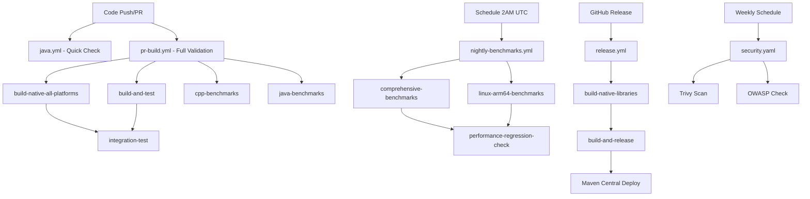

# GitHub Workflows Summary

Complete overview of all GitHub Actions workflows in the FastFilter Java project.

## Workflow Architecture

```
FastFilter Java CI/CD Pipeline
├── Development Workflows
│   ├── pr-build.yml          # Main PR/push workflow (comprehensive)
│   ├── java.yml              # Legacy Java CI (simple fallback)
│   └── test-local.yaml       # Manual testing helper
├── Maintenance Workflows
│   ├── nightly-benchmarks.yml # Performance regression detection
│   └── security.yaml         # Security vulnerability scanning
└── Release Workflows
    └── release.yml            # Production release builds
```

## Workflow Details

### 1. PR Build Workflow (`pr-build.yml`) ⭐ **Primary**

**Purpose**: Comprehensive build, test, and validation for all pull requests and pushes to master.

**Triggers**: 
- Pull requests to `master`/`main`
- Pushes to `master`/`main`

**Jobs Overview**:
- **`build-and-test`**: Multi-platform Java builds (Ubuntu, macOS, Windows)
- **`build-native-all-platforms`**: Cross-compilation of native libraries
- **`build-native-linux-arm64`**: ARM64 native builds via Docker/QEMU
- **`cpp-benchmarks`**: C++ performance benchmarks
- **`java-benchmarks`**: JMH benchmark execution
- **`integration-test`**: End-to-end integration tests

**Key Features**:
- ✅ JDK 24 with preview features
- ✅ Maven + Bazel build system support
- ✅ Multi-platform native library builds
- ✅ Performance benchmarking
- ✅ Cross-architecture testing (ARM64, x86_64)
- ✅ Artifact collection and caching

**Testing Matrix**:
```yaml
strategy:
  matrix:
    os: [ubuntu-latest, macos-latest, windows-latest]
    java: [24]
```

### 2. Nightly Benchmarks (`nightly-benchmarks.yml`) 📊

**Purpose**: Automated performance regression detection and historical tracking.

**Triggers**:
- Scheduled: Daily at 2 AM UTC
- Manual dispatch: `workflow_dispatch`

**Jobs Overview**:
- **`comprehensive-benchmarks`**: Full JMH + C++ benchmarks across platforms
- **`linux-arm64-benchmarks`**: ARM64 platform benchmarks
- **`performance-regression-check`**: Analysis and alerting

**Key Features**:
- ✅ Historical performance tracking
- ✅ Regression detection with 150% threshold
- ✅ Automated GitHub issue creation on regressions
- ✅ Multi-platform benchmark comparison
- ✅ JSON result artifacts for analysis

### 3. Release Workflow (`release.yml`) 🚀

**Purpose**: Production release builds with complete native library matrix.

**Triggers**:
- GitHub releases: `types: [created]`
- Manual dispatch with version input

**Jobs Overview**:
- **`build-native-libraries`**: Native libs for all platforms
- **`build-and-release`**: Main release orchestration

**Platform Matrix**:
| Platform | OS | Architecture | Bazel Target |
|----------|----|-----------|-----------| 
| linux-x86_64 | Ubuntu | x86_64 | `k8` |
| linux-arm64 | Ubuntu + Docker | ARM64 | `aarch64` |
| macos-x86_64 | macOS Intel | x86_64 | `darwin_x86_64` |
| macos-arm64 | macOS M1 | ARM64 | `darwin_arm64` |
| windows-x86_64 | Windows | x86_64 | `x64_windows` |

**Key Features**:
- ✅ Maven Central deployment
- ✅ GPG signing for releases
- ✅ Multi-platform native libraries
- ✅ Comprehensive testing before release
- ✅ GitHub release artifact uploads

### 4. Java CI Legacy (`java.yml`) 🔄

**Purpose**: Simple, fast Java-only builds for basic validation.

**Triggers**:
- Push/PR to master with Java/POM changes
- Excludes commits with `[skip ci]`

**Key Features**:
- ✅ Fast feedback for Java-only changes
- ✅ Path-based triggering (Java files, POM files)
- ✅ Basic Maven + Bazel validation
- ✅ Excludes heavy benchmarks and QEMU tests

### 5. Security Scan (`security.yaml`) 🔒

**Purpose**: Automated security vulnerability detection.

**Triggers**:
- Push/PR to master/main
- Weekly schedule (Sundays)

**Security Tools**:
- **Trivy**: Filesystem security scanning
- **OWASP Dependency Check**: Vulnerability database scanning

**Key Features**:
- ✅ SARIF result upload to GitHub Security
- ✅ HTML reports as artifacts
- ✅ Weekly automated scanning
- ✅ Integration with GitHub Security tab

### 6. Test Local (`test-local.yaml`) 🧪

**Purpose**: Simple manual testing helper.

**Triggers**: Manual dispatch only

**Key Features**:
- ✅ Basic build validation
- ✅ On-demand testing
- ✅ Oracle JDK distribution option

## Workflow Dependencies and Flow



## Environment Configuration Integration

All workflows support the project's `.env` file system:

- **Platform Detection**: Automatic `.env.{platform}` file loading
- **Environment Variables**: Consistent compiler, JDK, and library path configuration
- **Build System Integration**: Maven, Bazel, and Docker all use `.env` settings

## Caching Strategy

Optimized caching across all workflows:

```yaml
# Maven Dependencies
- uses: actions/cache@v4
  with:
    path: ~/.m2/repository
    key: maven-${{ runner.os }}-${{ hashFiles('**/pom.xml') }}

# Bazel Build Cache
- uses: actions/cache@v4
  with:
    path: |
      ~/.cache/bazel
      ~/.cache/bazelisk
    key: bazel-${{ runner.os }}-${{ hashFiles('MODULE.bazel') }}
```

## Artifact Management

Comprehensive artifact collection:

| Workflow | Artifacts | Purpose |
|----------|-----------|---------|
| **pr-build** | Native libraries, benchmark results | Testing and validation |
| **nightly-benchmarks** | Performance data, regression reports | Historical analysis |
| **release** | Release JARs, native libs, signatures | Distribution |
| **security** | Scan reports, SARIF files | Security analysis |

## Performance Characteristics

### Build Times (Approximate)
- **java.yml**: 2-3 minutes (Java only)
- **pr-build.yml**: 15-25 minutes (full matrix)
- **nightly-benchmarks.yml**: 30-45 minutes (comprehensive)
- **release.yml**: 45-60 minutes (full release)

### Resource Usage
- **CPU**: 2-4 cores per job
- **Memory**: 4-8GB per job
- **Storage**: 1-2GB artifacts per workflow run

## Success Criteria

### Required Checks (Branch Protection)
- ✅ `build-and-test` (Ubuntu, macOS, Windows)
- ✅ `build-native-all-platforms`
- ✅ `integration-test`
- ✅ Security scan (if configured)

### Optional Checks
- ⚪ C++ benchmarks (informational)
- ⚪ Java benchmarks (performance tracking)
- ⚪ Legacy Java CI (fast feedback)

## Local Testing Support

All workflows can be tested locally using the provided tools:

1. **Act**: `act pull_request -j build-and-test`
2. **Manual Scripts**: Via `WORKFLOW_TESTING.md` instructions
3. **Docker Simulation**: Cross-platform testing
4. **Environment Setup**: `.env` file integration

## Monitoring and Alerting

### Automatic Actions
- 📧 **Performance Regression**: GitHub issue creation
- 🔒 **Security Issues**: SARIF upload to GitHub Security
- 📈 **Benchmark Tracking**: Historical data collection
- 🚨 **Build Failures**: GitHub notifications

### Manual Review Points
- 👥 **PR Reviews**: Required for all changes
- 🔍 **Release Validation**: Manual approval for releases
- 📊 **Benchmark Analysis**: Review performance trends
- 🛡️ **Security Reports**: Weekly security review

## Best Practices Implemented

1. **Matrix Testing**: Multiple OS and JDK combinations
2. **Caching**: Efficient build caching strategies
3. **Artifact Management**: Proper cleanup and retention
4. **Security**: Regular vulnerability scanning
5. **Performance**: Automated regression detection
6. **Documentation**: Comprehensive testing guides
7. **Local Testing**: Full local workflow simulation
8. **Environment Consistency**: `.env` file integration

This workflow architecture provides comprehensive CI/CD coverage for the FastFilter Java project while maintaining efficiency and reliability across multiple platforms and build systems.